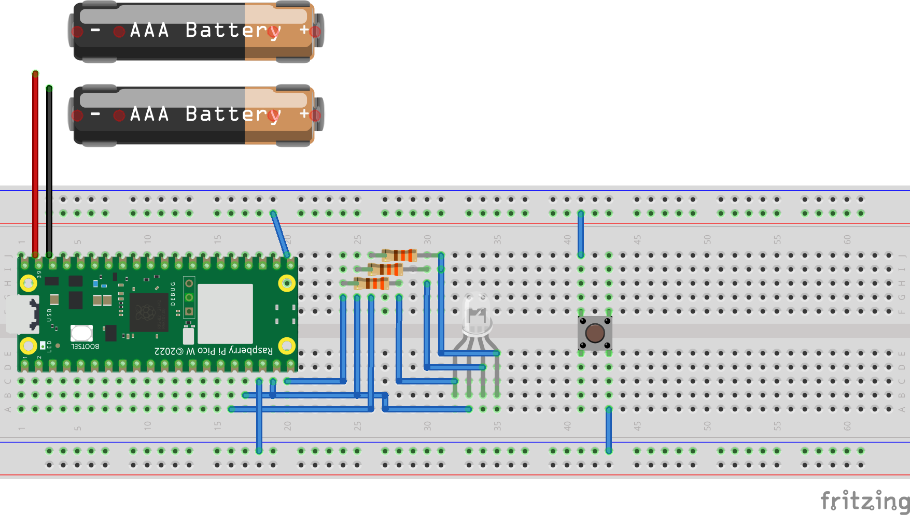

# Buzzer - The coordination game 
Buzzer is a coordination game based on Micropython pico w, the aim of which is to provide a series of self-printed buzzers to train personal reaction skills in a fun way.

## Installation
* Install Micropython (https://docs.micropython.org/en/latest/esp32/tutorial/intro.html#esp32-intro)
* Set up the Raspberry Pico W (https://projects.raspberrypi.org/en/projects/get-started-pico-w/1#)
* Install your IDE, e.g.: 
  * Thony - https://thonny.org
  * PyCharm Community Edition

## Project Structure 
- **Main** - Start of the project 
- **Config** - The class representation of the config file
- **ConfigManager** - Helper Class thats manage the loading, saving, or deleting the config file 
- **Logger** - Helper Class to log messages to the console
- **MicroWebserver** - Basic Webserver 
- **BuzzerClient** - This file contains two types of a buzzer client. The *BuzzerHttpClient* class will get executed by the buzzer client and the *BuzzerServerClient* will get exectuted by the server itself to guarantee a loop.
- **BuzzerGame** - This file contains a Harware-Wrapper class that encapsulates the control of the hardware and the managing and rules of the game itself.   
- **ClientHandler** - A handler that manages all buzzer clients. Concrete actions are adding, removing, handling timeouts, and adding commands.

## General procedure 
1. When the pico starts for the first time it will open a WLAN Access Point (*pico_buzzer*) with the password ( *1234567890* )
2. After connecting the WLAN the user can access the configuration of the pico via http://192.168.4.1/ to add all relevant information
3. The goal of the configuration page is to:
   * prepare the connect to the private WLAN 
   * configure whether the buzzer is the server or the client
   * setup the name of the server and the client for the further network communication
4. After entering all configuration the pico must be restarted to either boot as a server or a client
5. When the server or client boot it will connect to the local WLAN
6. The server will host a webserver that can be accessed by http://$buzzerserver-name/
7. The user can start or stop a new game with the mini website that is provided by the server
8. The clients will connect to the server via the webserver as well to get their commands from the server

## Circuit diagram

### Used Components
- Pico WH
- Wires
- 3 x 330 ohm resistor
- 1 x RGB LED common annode
- 1 x Push button
